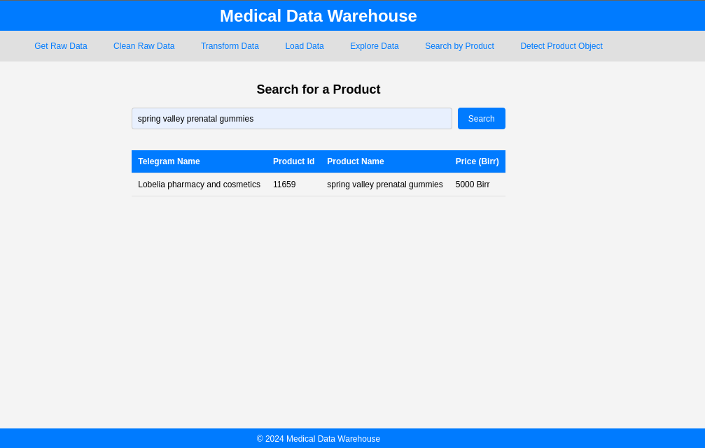

# Ethiopian Medical DataWarehouse using YoloV5

A comprehensive data warehouse solution for Ethiopian medical business data scraped from Telegram channels, including data scraping, object detection with YOLO, and ETL/ELT processes.

## Screenshot that shows the FastAPI Call



## Project Directory Structure

The repository is organized into the following directories:

- `.github/workflows/`: Contains configurations for GitHub Actions, enabling continuous integration and automated testing.
- `.vscode/`: Configuration files for the Visual Studio Code editor, optimizing the development environment.
- `app`: Contains the implementation of the machine learning model API, allowing interaction with the model through RESTful endpoints.
- `notebooks/`: Jupyter notebooks used for tasks such as data exploration, feature engineering, and preliminary modeling.
- `scripts/`: Python scripts for data preprocessing, feature extraction, and the implementation of the credit scoring model.
- `tests/`: Unit tests to ensure the correctness and robustness of the implemented model and data processing logic.

## Installation Instructions

To run the project locally, follow these steps:

1. **Clone the Repository:**

    ```bash
    git clone https://github.com/kebaHailu/Kara_medical_data_warehouse.git
    cd EthiomedDataWarehouse
    ```

2. **Set up the Virtual Environment:**

    Create a virtual environment to manage the project's dependencies:

    **For Linux/MacOS:**

    ```bash
    python3 -m venv .venv
    source .venv/bin/activate
    ```

    **For Windows:**

    ```bash
    python -m venv .venv
    .venv\Scripts\activate
    ```

3. **Install Dependencies:**

    Install the required Python packages by running:

    ```bash
    pip install -r requirements.txt
    ```

## Tasks

### Task 1: Scraping Data from Telegram Channels

- Navigate to the `scripts/` directory and run `telegram_scraper`.
- Ensure that the required libraries are installed and store the API ID and hash in the `.env` file.
- Next, run `data_cleaner.py` to auto-clean the data.
- Once cleaned, run `store_data.py`.
- Ensure you create a database in your PostgreSQL database and store credentials in the `.env` file, then start the PostgreSQL server.

### Task 2: Data Transformation using DBT

- Go to the `ethio_medical_project` directory and explore the DBT configurations.
- Run the DBT commands:

    ```bash
    dbt run
    ```

- Testing and documentation:

    ```bash
    dbt test
    dbt docs generate
    dbt docs serve
    ```

### Task 3: Object Detection using YOLO

- **Setting Up the Environment**: Ensure you have the necessary dependencies installed, including YOLO and its required libraries (e.g., OpenCV, TensorFlow, or PyTorch depending on the YOLO implementation).

    ```bash
    pip install opencv-python
    pip install torch torchvision  # for PyTorch-based YOLO
    pip install tensorflow  # for TensorFlow-based YOLO
    ```

- **Downloading the YOLO Model**:

    ```bash
    git clone https://github.com/ultralytics/yolov5.git
    cd yolov5
    pip install -r requirements.txt
    ```

- Once you are installed the yolo model, go to the notebooks directory and Run the notebook to check the outputs and explore the PostgreSQL database for stored data.

### Task 4: FastAPI Integration

- Make sure you are in the root directory and run this command:

    ```bash
    uvicorn app.main:app --reload
    ```

- Note: Ensure that all the required libraries are installed. You can install any missing dependencies manually using `requirements.txt`.

## Contributing

We welcome contributions to improve the project. Please follow the steps below to contribute:

- Fork the repository.
- Create a new branch for your feature or bugfix.
- Submit a pull request with a detailed explanation of your changes.
